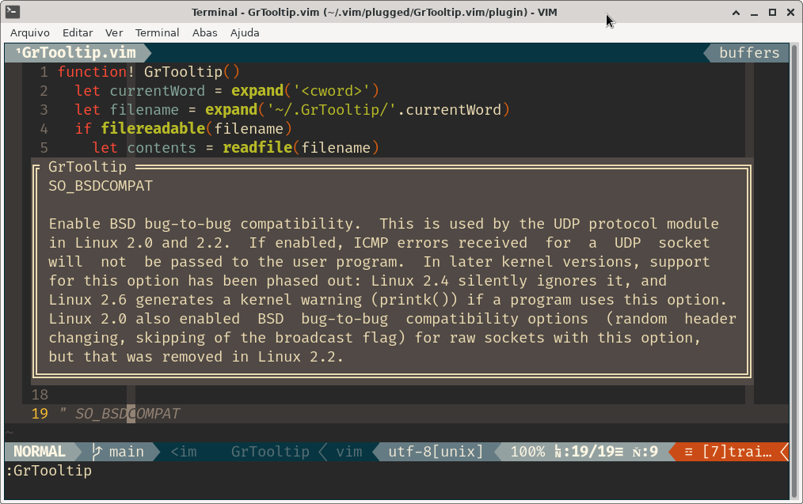

# GrTooltip.vim

Show tooltip for the current word.

## Motivation

This utility was made to aid the network code review by bringing tips for the
flags with very cryptic names.

## How to use

Move the cursor over the word and call the `GrTooltip` command or press
`<C-G><C-T>` shortcut.



## Tooltips database

All tooltips are plaintext files in the `~/.GrTooltip/` folder.

## Instalation

### With vim-plug

```vim
Plug 'geraldolsribeiro/vim-GrTooltip'
```

## Database

An initial database can be found in the
https://github.com/geraldolsribeiro/GrTooltip repository.
